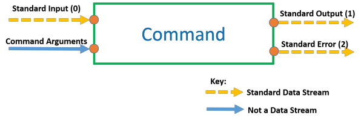
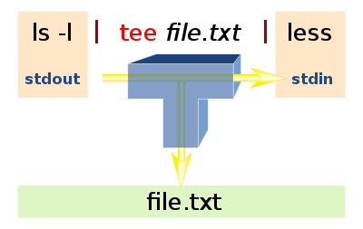

# The Linux Command Line

*Notes are taking from [Ziyad Yehia](https://www.udemy.com/user/ziyadyehia2/) [Udemy](https://www.udemy.com/) course [Linux Mastery: Master the Linux Command](https://www.udemy.com/course/linux-mastery/#instructor-1).*

[toc]

## Important Definitions

| command  | description                                                  |
| -------- | ------------------------------------------------------------ |
| Command  | An instruction typed in the terminal and submitted to the shell for interpretation. |
| Shell    | A program that interprets commands for meaning.              |
| Terminal | A graphical window where commands can be typed and submitted to the shell. |

## Command Structure  

(*[Udemy 7: command structure](https://www.udemy.com/course/linux-mastery/learn/lecture/8227618#overview)*)

- Each command follows the same overarching structure:  

  **`commandName –options arguments`**

  - **commandName**

    - Must be a valid program on the Shell’s Path. To check this, you can use the `which` command:  

      `which commandName`

    - If a path is returned, then the commandName is valid.

  - **options**

    - You can specify options for each command to customise the commands behaviour. These can be either “short-form” options or “long-form” options.

      - Short-form Options

        Short-form options are where a letter defines an option. Each option is prepended by a dash “**`-`**“ :

        `commandName –a –b –c args`
        *To save typing, you could join together the options:*
        `commandName –abc args`
        *Both of these formats are equivalent.*

      - Long-form Options

        For some commands, there are long-form options defined to make options easier to identify. Long form options are usually prepended by a double dash “**`--`**“.

        Long-form options **cannot** be joined together like short-form options can.
        Whether they are defined or not depends on each specific command, so consult the command’s manual page for more information.
        If long form options are defined for options “a”, “b” and “c”, then:
        `commandName –a –b -c arguments`
        *is equivalent to*
        `commandName --alpha --beta --charlie arguments`

  - **Command Line Arguments**

    - Are a type of input that commands operate on. Some commands can take an unlimited amount of inputs, some take a specific amount, and some take none at all. Consult the manual page for the specific command for more information.
      `cal 12 2017`
      *Here the cal command has 2 command line arguments. The number 12 and the number 2017.*

  - **Arguments for Options**
    - Sometimes, command options can also take their own arguments (inputs).
      `cal –A 1 –B 1 12 2017`
      *Here the cal command has 2 options; A and B.*
      *The A option has its own argument (1).*
      *The B option has its own argument (1).*
      *And the cal command has 2 command line arguments (12 and 2017).*

## Command Input and Output  

(*[Udemy 11: input / output](https://www.udemy.com/course/linux-mastery/learn/lecture/8266810#overview)*)

Standard Data Streams can be redirected and are identified using their stream number.
Redirection of the standard output of one command to the standard input of another
command is known as piping.

- **Redirecting Standard Output:**

  Standard output is stream number 1. There are 2 methods to redirect standard output.
  The long form, using the stream number:
  `commandName –options arguments 1> destination`
  *Or the short form, with no stream number:*
  `commandName –options arguments > destination`

- **Redirecting Standard Error:**
  Standard error is stream number 2.
  Here is how to redirect standard error
  `commandName –options arguments 2> destination`
  *Standard error can be redirected at the same time as standard output:*
  `commandName –options arguments 1> output_destination 2> error_destination`

- **Redirecting Standard Input:**
  Standard Input is stream number 0. There are 2 methods to redirect standard Input.
  The long form, using the stream number:
  `commandName –options arguments 0< input_source`
  *Or the short form, with no stream number:*
  `commandName –options arguments < input_source`

## Piping  

(*[Udemy 14: piping](https://www.udemy.com/course/linux-mastery/learn/lecture/8268162#overview)*)

> Piping is the connection of the standard output of one command to the standard input of
> another command.

Piping using the pipe character **`|`** (*SHIFT + BACKSLASH*) .
Here is how you would pipe together commandOne and commandTwo:
`commandOne –options arguments | commandTwo –options arguments`
*Notice how both commands can have their own options and command line arguments as*
*usual.* This piping can go on for as long as is required with as many commands as is required.

- **Taking “Snapshots” of pipeline data using the tee command :**

  > Redirecting during a pipeline breaks the pipeline.

  

  *For example, this wouldn’t work:*
  `commandOne –options arguments > snapshot.txt | commandTwo –options arguments`
  *Because redirection is processed by the shell before piping is, snapshot.txt would be created,*
  *but this locks up the standard output stream and therefore no data can be passed through the*
  *pipeline to commandTwo.*
  However, the tee command allows us to take a “snapshot” of the data in the pipeline without
  breaking the pipeline.
  `commandOne –options arguments | tee snapshot.txt | commandTwo –options arguments`
  *Here, a snapshot of the data coming out of commandOne is saved in snapshot.txt, but the data*
  *is also successfully piped through to commandTwo.*

- **Piping to commands that only accept command line arguments by using xargs :**

  Piping connects the standard output of one command to the standard input of another
  command.
  But what if the second command doesn’t accept standard input? e.g. the echo command.
  The key is to transform the data coming in, into command line arguments.
  This is possible using the **`xargs`** command.
  *For example, this would not work:*
  `commandOne –options arguments | echo`
  *This would work:*
  `commandOne –options arguments | xargs echo`
  
  **Note:** Commands you use with xargs can still have their own arguments.

## Aliases  

(*[Udemy 17: aliases](https://www.udemy.com/course/linux-mastery/learn/lecture/8289492#overview)*)

> Aliases allow you to save your pipelines and commands with easy to remember nicknames so
> that they can be used later much easier.

1. You define aliases in your `.bash_aliases` file in your home directory. If it does not exist, you
   need to create it spelled exactly as shown. Note that the preceding period (.) must be included
   and there should be no file extension (such as .txt, or .pdf).
2. Here is how you define an alias in .bash_aliases:
   `alias aliasName=”THING YOU WANT TO ALIAS”`
   Notice that there are no spaces between the equals sign (=) and the aliasName and the quotes
   (“). The quotes can be double quote (“) or single quotes (‘).

*Let’s take an example:*
`alias calmagic=”cal –A 1 –B 1 12 2017”`
With this alias defined in our .bash_aliases file, whenever we run the calmagic command it is as if we ran the cal –A 1 –B 1 12 2017 command.
calmagic is now said to be an alias of “cal –A 1 –B 1 12 2017”.
NB: Aliases may contain either one command or an entire pipeline!

- **Piping to an alias**  
  
  > If the first command in an alias accepts standard input, then the alias can be piped to; even if it is an entire pipeline!  
  
  *Our alias is currently:*
  `alias calmagic=”cal –A 1 –B 1 12 2017”`
  *cal is the first command in this alias, but cal doesn’t accept standard input.*
  *Therefore, this would not work:*
  `commandOne –options arguments | calmagic`
  *However, if we adjust our alias so that it can accept standard input.*
  `alias calmagic=”xargs cal –A 1 –B 1 12 2017”`
  *This will now work:*
  `commandOne –options arguments | calmagic`
  And yes, you can pipe out of an alias as well, if the alias produces standard output.
  `commandOne –options arguments | calmagic | commandTwo –options arguments`
  Think of aliases as building blocks that you can use in more sophisticated pipelines.

## Using the Manual  

(*[Udemy 8: manual](https://www.udemy.com/course/linux-mastery/learn/lecture/8262650#overview)*)

| command               | description                                                  |
| --------------------- | ------------------------------------------------------------ |
| man –k \<search term> | Search the manual for pages matching \<search term>.         |
| man 5 \<page name>    | Open the man page called \<page name> in section 5 of the manual. (replace \<page name> and 5 as required) |
| man \<page name>      | Open the man page called \<page name> in section 1 of the manual. |

Symbols and their meaning in the manuale:

| section          | meaning                                                      |
| ---------------- | ------------------------------------------------------------ |
| [THING]          | THING is optional.                                           |
| \<THING>         | THING is mandatory (required)                                |
| THING …          | THING can be repeated (limitless)                            |
| THING1 \| THING2 | Use THING1 **OR** THING2. Not Both.                          |
| *THING*          | [Notice the Italics] Replace THING with whatever is appropriate. |

## Important Short Cuts & Commands

- **Opening and Closing the Terminal :**  (*[Udemy 9: open close terminal](https://www.udemy.com/course/linux-mastery/learn/lecture/8202508#overview)*)

| description          | short cut     |
| -------------------- | ------------- |
| Opening The Terminal | CTRL + ALT +T |
| Closing The Terminal | CTRL + D      |

- **Command History :**

| command    | description                                                  |
| ---------- | ------------------------------------------------------------ |
| history    | Show commands previously entered (command history).          |
| !!         | Run the previous command.                                    |
| !50        | Run the command that is on line 50 of the output from the history command. (replace “50” as needed). |
| history -c | clear the history list by deleting all of the entries        |

- **Key Commands for Navigating the File System** (*[Udemy 20: file system](https://www.udemy.com/course/linux-mastery/learn/lecture/8345744#overview)*)

| command              | description                                                  |
| -------------------- | ------------------------------------------------------------ |
| pwd                  | Print on standard output the absolute path to the shell’s current working directory. |
| cd [\<new location>] | Change the shell’s current working directory to the optional \<new location>. If no location is provided, return to the user’s home directory. |
| ls \[\<location>]    | List out the contents of the optional \<location> directory. If no \<location> is provided, print out the contents of the shell’s current working directory. |

- **Key Shortcuts when Navigating File System**

| command | description                                 |
| ------- | ------------------------------------------- |
| ~       | The current user’s home directory           |
| .       | The current folder.                         |
| ..      | The parent directory of the current folder. |

- **Wildcards and Regular Expressions** *([Udemy 25: wildcards](https://www.udemy.com/course/linux-mastery/learn/lecture/7899304#overview)*)

> **Regular expressions** are patterns that can be used to match text. In Linux, they are used to allow a user to make rather generic expressions about what files they want a command to operate on.
> Creating regular expressions to match filenames is known as **globbing**.  

The regular expression patterns can be made using **special building blocks** known as **wildcards**.
**Wildcards** are symbols with specific meanings to the shell.

| command   | description                                         |
| --------- | --------------------------------------------------- |
| *         | Matches anything, regardless of length.             |
| ?         | Matches anything, but for one place only.           |
| [options] | Matches any of the options inside for 1 place only. |

- **Creating Files and Directories**

| command              | description                                             |
| -------------------- | ------------------------------------------------------- |
| touch \<*FILE*>      | Creates an empty file. e.g. `touch ~/Desktop/file1.txt` |
| mkdir \<*DIRECTORY*> | Creates an empty directory. e.g. `mkdir ~/newdir`       |

- **Deleting Files and Directories**

| command                    | description                                                  |
| -------------------------- | ------------------------------------------------------------ |
| rm \<*FILE*>               | Remove a file e.g. `rm ~/Desktop/file1.txt`                  |
| rm -r \<*DIRECTORY*>       | Removes a directory. e.g. `rm -r ~/newdir`                   |
| rm –i                      | Removes in an interactive manner. This is a good safety measure. |
| rmdir \<*EMPTY DIRECTORY*> | Only remove empty directories e.g. `rmdir ~/emptydir`        |

- **Editing Files with the Nano Editor**

| command | description                                                  |
| ------- | ------------------------------------------------------------ |
| ^       | This is the **CTRL** key on your keyboard. For example, **^O** is **CTRL + O**. |
| M-      | This is the “meta” key on your keyboard. Depending on your keyboard layout this may be the **ALT**, **ESC**, **CMD** key. Try it out Assuming M- is the ALT key, then M-X is ALT + X |

- **The Locate Command** (*[Udemy 35: locate](https://www.udemy.com/course/linux-mastery/learn/lecture/8433238#overview)*)

> The **`locate`** command searches a **database** on your file system for the files that match the text (or regular expression) that you provide it as a command line argument. If results are found, the locate command will return the **absolute path** to all matching files.  

*For example:*
`locate *.txt`
will find all files with filenames ending in .txt that are registered in the database.
The locate command is fast, but because it relies on a database it can be error prone if the database isn’t kept up to date.
Below are some commands to update the database and some reassuring procedures in case one cannot access administrator privileges.

| command           | description                                                  |
| ----------------- | ------------------------------------------------------------ |
| locate -S         | Print information about the database file.                   |
| sudo updatedb     | Update the database. As the updatedb command is an administrator command, the sudo command is used to run updatedb as the root user (the administrator) |
| locate --existing | Check whether a result actually exists before returning it.  |
| locate –limit 5   | Limit the output to only show 5 results                      |

- **The Find Command** (*[Udemy 37: find](https://www.udemy.com/course/linux-mastery/learn/lecture/8479086#overview)*)

> The **`find`** command can be used for more sophisticated search tasks than the locate command. This is made possible due to the many powerful options that the **`find`** command has. The first thing to note is that the **`find`** command will list both files and directories, below the point the file tree that it is told to start at.  

*For example:*
`find .`
Will list all files and directories below the current working directory (which is denoted by the .)
`find /`
Will list all files and directories below the base directory (/); thereby listing everything on the entire file system! By default, the find command will list everything on the file system below its starting point, to an infinite depth. The search depth can however be limited using the **`–maxdepth`** option.
*For example:*
`find / -maxdepth 4`
Will list everything on the file system below the base directory, provided that it is within 4 levels of the base directory.

| command       | description                                                  |
| ------------- | ------------------------------------------------------------ |
| -type         | Only list items of a certain type. **`–type f`** restricts the search to file and **`–type d`** restricts the search to directories. |
| -name “*.txt” | Search for items matching a certain name. This name may contain a regular expression and **should be enclosed in double quotes** as shown. In this example, the find command will return all items with names ending in .txt. |
| -iname        | Same as **`–name`** but uppercase and lowercase do not matter. |
| -size         | Find files based on their size. e.g `–size +100k` finds files over 100 KiB in `size –size -5M` finds files less than 5MiB in size. Other units include `G` for GiB and `c` for bytes[^footnote]. |

[^footnote]: Note: 1 Kibibyte (KiB) = 1024 bytes. 1 Mebibyte (MiB) = 1024 KiB. 1 Gibibyte = 1024 MiB.

A supremely useful feature of the find command is the ability to execute another command on each of the results.
*For example:*
`find /etc –exec cp {} ~/Desktop \;`
will copy every item below the `/etc` folder on the file system to the `~/Desktop directory`.
Commands are executed on each item using the **`–exec`** option.
The argument to the **`–exec`** option is the command you want to execute on each item found by the **`find`** command.
Commands should be written as they would normally, with **`{}`** used as a placeholder for the results of the **`find`** command.
Be sure to terminate the **`–exec`** option using **`\;`** (a backslash then a semicolon).
The **`–ok`** option can also be used, to prompt the user for permission before each action. This can be tedious for a large number of files, but provides an extra layer of security of a small number of files; especially when doing destructive processes such as deletion.
*For example:*
`find /etc –ok cp {} ~/Desktop \;`

- **Viewing File Content**

  - **`cat`** command (*[Udemy 42: cat](https://www.udemy.com/course/linux-mastery/learn/lecture/8496430#overview)*)

    > The **`cat`** command (*con**cat**enate*) joins files or prints their contents to standard output.

    *By performing:*
    `cat ~/Desktop/hello.txt`
    *This will print out the contents of `hello.txt` to standard output where it can be viewed or piped to other commands if required.*
    `cat file[1-5].txt > file_content.txt`
    *Copies the content of the files `file1.txt`, `file2.txt`, ... to the `file_content.txt`, it can be also used to joine mp3 files.*

  - **`less`** command (*[Udemy 43: less](https://www.udemy.com/course/linux-mastery/learn/lecture/8496826#overview)*)

  > The **`less`** command is known as a “pager” program and excels at allowing a user to page through large amounts of output in a more user-friendly manner than just using the terminal.  

  *An example may be:*
  `cat ~/Desktop/hello.txt | less`
  *Or more simply:*
  `less ~/Desktop/hello.txt`
  By pressing the **`q`** key, the **`less`** command can be terminated and control regained over the shell.

| command               | description                                                  |
| --------------------- | ------------------------------------------------------------ |
| tac \<*FILE*>         | Print a file’s contents to standard output, reversed vertically. |
| rev \<*FILE*>         | Print a file’s content to standard output, reversed horizontally (along rows). |
| head –n 15  \<*FILE*> | Read the first 15 lines from a file (10 by default if -n option not provided.) |
| tail –n 15  \<*FILE*> | Read the bottom 15 lines from a file (10 by default if -n option not provided.) |

- **Sorting Data**  (*[Udemy 44: sort](https://www.udemy.com/course/linux-mastery/learn/lecture/8497382#overview)*)

> A useful ability when working with file data is to be able to sort it either alphabetically or numerically.  

This behaviour is handled using the **`sort`** command. By default, the **`sort`** command sorts smallest first. So if sorting alphabetically, it will by default sort from a – z. If sorting numerically, it will put the smallest numbers first, and largest last. 

| command | description                              |
| ------- | ---------------------------------------- |
| sort -r | Reverse the default sorting order.       |
| sort -n | Sort in a numerical manner.              |
| sort -u | Sort data an only return unique entries. |

It is also possible to sort tabular data using the **`sort`** command using one of the columns. This is possible by providing a `KEYDEF` as an argument to the **`–k`** option (*[Udemy 45: tabular](https://www.udemy.com/course/linux-mastery/learn/lecture/8497384#overview)*). `sort –k <KEYDEF>`
`KEYDEFS` are made using a column number and then additional options can be added (without dashes).
*As an example:*
`sort –k 5nr`
The **`KEYDEF`** is **`5nr`**. This will sort using column 5 of the data, and sort numerically (**`-n option`**) but in reverse (**`-r option`**).

- **Searching File Contents**  (*[Udemy: 47: grep](https://www.udemy.com/course/linux-mastery/learn/lecture/8502228#overview)*)

> The ability to search for and filter out what you want from a file or standard output makes working with the command line a much more efficient process. The command for this is called the **`grep`** command. The **`grep`** command will return all lines that match the particular piece of text (or regular
> expression) provided as a search term.  

*For example:* 
`grep hello myfile.txt`
Will return all lines containing the word “hello” in myfile.txt
*and*
`ls /etc | grep *.conf`
will return all lines with anything ending in “.conf” in data piped from the **`ls`** command.

| command | description                                                  |
| ------- | ------------------------------------------------------------ |
| grep -i | Search in a case insensitive manner (upper case and lowercase don’t matter). |
| grep -v | Invert the search. i.e return all lines that DON’T contain a certain search term. |
| grep -c | Return the number of lines (count) that match a search term rather than the lines themselves. |

## File Archiving and Compression
- **The Overall Process**
  Archiving and compressing files in Linux is a two-step process.
  1. Create a Tarball:
     A tarball is a way of bundling together the files that you want to archive. It is the "container" which can be compressed after.
  2. Compress the tarball with a compression algorithm:
     Compress that tarball with one of a variety of compression algorithms; leaving you with a compressed archive.

1. **Creating a Tarball**

​	`tar –cvf <TARBALL_NAME.tar> <FILE>…`

| command / option      | description                                                  |
| --------------------- | ------------------------------------------------------------ |
| tar                   | command to create the **tar**ball                            |
| –c                    | “**c**reate”. This allows us to create a tarball. **[required]** |
| -v                    | "**v**erbose" output to verify the operation                 |
| -f                    | Tells tar that the next argument is the name of the tarball. **[required]** |
| \<*TARBALL_NAME.tar*> | The absolute or relative file path to where you want the tarball to be placed ending with the name of the tarball; e.g. `~/Desktop/myarchive.tar` Note: the file ending **`.tar`** is a convention, the Linux system knows without it that it is a **`.tar`** file. |
| \<FILE>               | File or files to be added to the tarball, only needs path if not in current directory.  Wildcards are accepted. |

​	**1.1** **Checking a Tarball’s Contents**
​	`tar –tf <TARBALL_NAME.tar>`

| option | description                                                  |
| ------ | ------------------------------------------------------------ |
| -t     | “**t**est-label”. This allows us to check the contents of a tarball. (*Note -f is still **required***) |

​	**1.2** **Adding to a Tarball**

> A feature of the archive is that it allows for multiple files with the same name. If you append a file with the same name, then the file is just appended to the end of the archive without deleting the previous one. But when you extract the archive, it will extract the latest version (by its order inside the archive) of the file.  

​	`tar –rvf <TARBALL_NAME.tar> <FILE>…`

| option          | description                                                  |
| --------------- | ------------------------------------------------------------ |
| -r *or* -append | add(s)/append(s) file(s) to the tar ball. (*Note -f is still **required***) |

​	`tar –uvf <TARBALL_NAME.tar> <FILE>…`

| option | description                                                  |
| ------ | ------------------------------------------------------------ |
| -u     | The "**u**pdate" refreshes the files that are newer than the ones in the archive, so it works slightly different than the *–append* (or *-r*) option but provides the same functionality for the addition of a new file. (*Note -f is still **required***) |

​	**1.3** **Extracting From a Tarball**

> Extracting a tarball does not empty the tarball. You can extract from a tarball as many times as you want without affecting the tarball’s contents.

​	`tar –xf <TARBALL_NAME.tar>`

| option | description                                                  |
| ------ | ------------------------------------------------------------ |
| -x     | “**e**xtract”. This allows us to extract a tarball’s contents. (*Note -f is still **required***) |

2. **Compressing Tarballs**

> Tarballs are just containers for files. They don’t by themselves do any compression, but the can be compressed using a variety of compression algorithms The main types of compression algorithms are **`gzip`** and **`bzip2`**.

The **`gzip`** compression algorithm tends to be faster than **`bzip2`** but, as a trade-off, **`gzip`** usually offers less compression.

| command                       | description                                                  |
| ----------------------------- | ------------------------------------------------------------ |
| gzip *<FILE_NAME>*            | compressing with gzip[^footnote2]                            |
| gunzip *<FILE_NAME>*          | decompressing with gunzip                                    |
| bzip2 *<FILE_NAME>*           | compressing with bzip2[^footnote2]                           |
| bunzip2 *<FILE_NAME>*         | decompressing with bunzip2                                   |
| zip *<ZIP_FILE>* *\<FILE>*... | creating a .zip archive (*no tarball needed*) (*file name can contain wildcards*) |
| unzip *<ZIP_FILE>*            | extracting a .zip archive                                    |

[^footnote1]:When compressing with gzip, the file extension .gz is automatically added to the .tar archive. Therefore, the gzip compressed tar archive would, by convention, have the file extension .tar.gz
[^footnote2]:When compressing with bzip2, the file extension .bz2 is automatically added to the .tar archive. Therefore, the bzip2 compressed tar archive would, by convention, have the file extension .tar.bz2
3. **Doing it all in one step**

   | command | example                                                  | description                                                  |
   | ------- | -------------------------------------------------------- | ------------------------------------------------------------ |
   | -z -c   | tar –**c**v**z**f *<TARBALL_NAME.tar>* *<FILE_NAME>* ... | **c**reating a tarball and compressing via gzip (*Note -f is still **required***) |
   | -z -x   | tar –**x**v**z**f *<TARBALL_NAME.tar>*                   | decompressing a tarball and e**x**tracting via gzip (*Note -f is still **required***) |
   | -j -c   | tar –**c**v**j**f *<TARBALL_NAME.tar>* *<FILE_NAME>* ... | **c**reating a tarball and compressing via bzip2 (*Note -f is still **required***) |
   | -j -x   | tar –**x**v**j**f *<TARBALL_NAME.tar>*                   | decompressing a tarball and e**x**tracting via bzip2 (*Note -f is still **required***) |
   | -J -c   | tar –**c**v**J**f *<TARBALL_NAME.tar>* *<FILE_NAME>* ... | **c**reating a tarball and compressing via xzip (*Note -f is still **required***) |
   | -J -x   | tar –**x**v**J**f *<TARBALL_NAME.tar>* ...               | decompressing a tarball and e**x**tracting via xzip (*Note -f is still **required***) |

   
