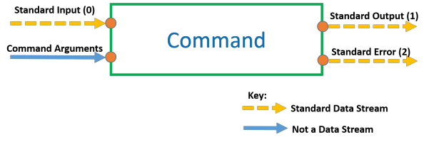

# The Linux Command Line

[toc]

## Important Definitions

| command  | description                                                  |
| -------- | ------------------------------------------------------------ |
| Command  | An instruction typed in the terminal and submitted to the shell for interpretation. |
| Shell    | A program that interprets commands for meaning.              |
| Terminal | A graphical window where commands can be typed and submitted to the shell. |

## Command Structure

- Each command follows the same overarching structure:  

  **`commandName –options arguments`**

  - **commandName**

    - Must be a valid program on the Shell’s Path. To check this, you can use the `which` command:  

      `which commandName`

    - If a path is returned, then the commandName is valid.

  - **options**

    - You can specify options for each command to customise the commands behaviour. These can be either “short-form” options or “long-form” options.

      - Short-form Options

        Short-form options are where a letter defines an option. Each option is prepended by a dash “**`-`**“ :

        `commandName –a –b –c args`
        *To save typing, you could join together the options:*
        `commandName –abc args`
        *Both of these formats are equivalent.*

      - Long-form Options

        For some commands, there are long-form options defined to make options easier to identify. Longform options are usually prepended by a double dash “**`--`**“.

        Long-form options **cannot** be joined together like short-form options can.
        Whether they are defined or not depends on each specific command, so consult the command’s manual page for more information.
        If long form options are defined for options “a”, “b” and “c”, then:
        `commandName –a –b -c arguments`
        *is equivalent to*
        `commandName --alpha --beta --charlie arguments`

  - **Command Line Arguments**

    - Are a type of input that commands operate on. Some commands can take an unlimited amount of inputs, some take a specific amount, and some take none at all. Consult the manual page for the specific command for more information.
      `cal 12 2017`
      *Here the cal command has 2 command line arguments. The number 12 and the number 2017.*

  - **Arguments for Options**
    - Sometimes, command options can also take their own arguments (inputs).
      `cal –A 1 –B 1 12 2017`
      *Here the cal command has 2 options; A and B.*
      *The A option has its own argument (1).*
      *The B option has its own argument (1).*
      *And the cal command has 2 command line arguments (12 and 2017).*

## Command Input and Output

Standard Data Streams can be redirected and are identified using their stream number.
Redirection of the standard output of one command to the standard input of another
command is known as piping.

- **Redirecting Standard Output:**

  Standard output is stream number 1. There are 2 methods to redirect standard output.
  The long form, using the stream number:
  `commandName –options arguments 1> destination`
  *Or the short form, with no stream number:*
  `commandName –options arguments > destination`

- **Redirecting Standard Error:**
  Standard error is stream number 2.
  Here is how to redirect standard error
  `commandName –options arguments 2> destination`
  *Standard error can be redirected at the same time as standard output:*
  `commandName –options arguments 1> output_destination 2> error_destination`

- **Redirecting Standard Input:**
  Standard Input is stream number 0. There are 2 methods to redirect standard Input.
  The long form, using the stream number:
  `commandName –options arguments 0< input_source`
  *Or the short form, with no stream number:*
  `commandName –options arguments < input_source`

## Piping

> Piping is the connection of the standard output of one command to the standard input of
> another command.

Piping using the pipe character **`|`** (*SHIFT + BACKSLASH*) .
Here is how you would pipe together commandOne and commandTwo:
`commandOne –options arguments | commandTwo –options arguments`
*Notice how both commands can have their own options and command line arguments as*
*usual.* This piping can go on for as long as is required with as many commands as is required.

- **Taking “Snapshots” of pipeline data using the tee command :**

  > Redirecting during a pipeline breaks the pipeline.

  

  *For example, this wouldn’t work:*
  `commandOne –options arguments > snapshot.txt | commandTwo –options arguments`
  *Because redirection is processed by the shell before piping is, snapshot.txt would be created,*
  *but this locks up the standard output stream and therefore no data can be passed through the*
  *pipeline to commandTwo.*
  However, the tee command allows us to take a “snapshot” of the data in the pipeline without
  breaking the pipeline.
  `commandOne –options arguments | tee snapshot.txt | commandTwo –options arguments`
  *Here, a snapshot of the data coming out of commandOne is saved in snapshot.txt, but the data*
  *is also successfully piped through to commandTwo.*

- **Piping to commands that only accept command line arguments by using xargs :**

  Piping connects the standard output of one command to the standard input of another
  command.
  But what if the second command doesn’t accept standard input? e.g. the echo command.
  The key is to transform the data coming in, into command line arguments.
  This is possible using the **`xargs`** command.
  *For example, this would not work:*
  `commandOne –options arguments | echo`
  *This would work:*
  `commandOne –options arguments | xargs echo`
  
  **Note:** Commands you use with xargs can still have their own arguments.

## Aliases

> Aliases allow you to save your pipelines and commands with easy to remember nicknames so
> that they can be used later much easier.

1. You define aliases in your `.bash_aliases` file in your home directory. If it does not exist, you
   need to create it spelled exactly as shown. Note that the preceding period (.) must be included
   and there should be no file extension (such as .txt, or .pdf).
2. Here is how you define an alias in .bash_aliases:
   `alias aliasName=”THING YOU WANT TO ALIAS”`
   Notice that there are no spaces between the equals sign (=) and the aliasName and the quotes
   (“). The quotes can be double quote (“) or single quotes (‘).

*Let’s take an example:*
`alias calmagic=”cal –A 1 –B 1 12 2017”`
With this alias defined in our .bash_aliases file, whenever we run the calmagic command it is as if we ran the cal –A 1 –B 1 12 2017 command.
calmagic is now said to be an alias of “cal –A 1 –B 1 12 2017”.
NB: Aliases may contain either one command or an entire pipeline!

- **Piping to an alias**
  If the first command in an alias accepts standard input, then the alias can be piped to; even if it is an entire pipeline!
  *Our alias is currently:*
  `alias calmagic=”cal –A 1 –B 1 12 2017”`
  *cal is the first command in this alias, but cal doesn’t accept standard input.*
  *Therefore, this would not work:*
  `commandOne –options arguments | calmagic`
  *However, if we adjust our alias so that it can accept standard input.*
  `alias calmagic=”xargs cal –A 1 –B 1 12 2017”`
  *This will now work:*
  `commandOne –options arguments | calmagic`
  And yes, you can pipe out of an alias as well, if the alias produces standard output.
  `commandOne –options arguments | calmagic | commandTwo –options arguments`
  Think of aliases as building blocks that you can use in more sophisticated pipelines.

## Using the Manual

| command               | description                                                  |
| --------------------- | ------------------------------------------------------------ |
| man –k \<search term> | Search the manual for pages matching \<search term>.         |
| man 5 \<page name>    | Open the man page called \<page name> in section 5 of the manual. (replace \<page name> and 5 as required) |
| man \<page name>      | Open the man page called \<page name> in section 1 of the manual. |

Symbols and their meaning in the manuale:

| section          | meaning                                                      |
| ---------------- | ------------------------------------------------------------ |
| [THING]          | THING is optional.                                           |
| \<THING>         | THING is mandatory (required)                                |
| THING …          | THING can be repeated (limitless)                            |
| THING1 \| THING2 | Use THING1 **OR** THING2. Not Both.                          |
| *THING*          | [Notice the Italics] Replace THING with whatever is appropriate. |

## Important Short Cuts

- **Opening and Closing the Terminal :**

| description          | short cut     |
| -------------------- | ------------- |
| Opening The Terminal | CTRL + ALT +T |
| Closing The Terminal | CTRL + D      |

- **Command History :**

| description | short cut                                                    |
| ----------- | ------------------------------------------------------------ |
| history     | Show commands previously entered (command history).          |
| !!          | Run the previous command.                                    |
| !50         | Run the command that is on line 50 of the output from the history command. (replace “50” as needed). |
| history -c  | clear the history list by deleting all of the entries        |

